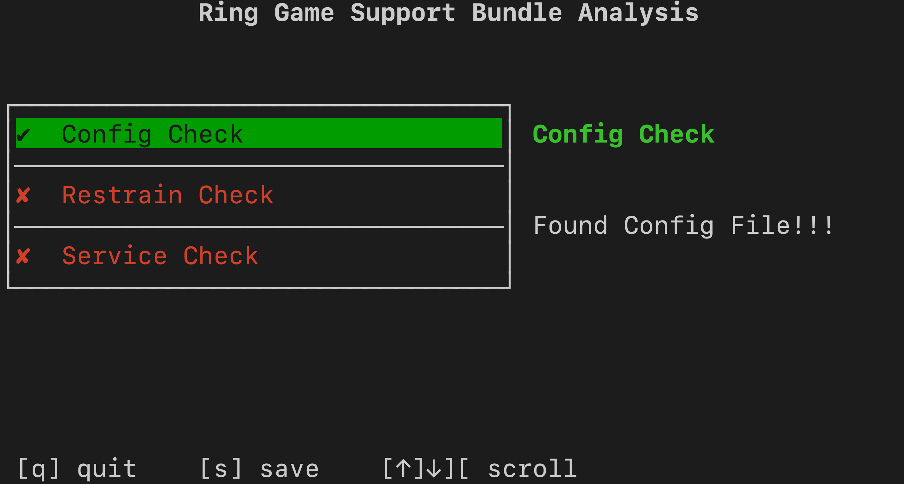
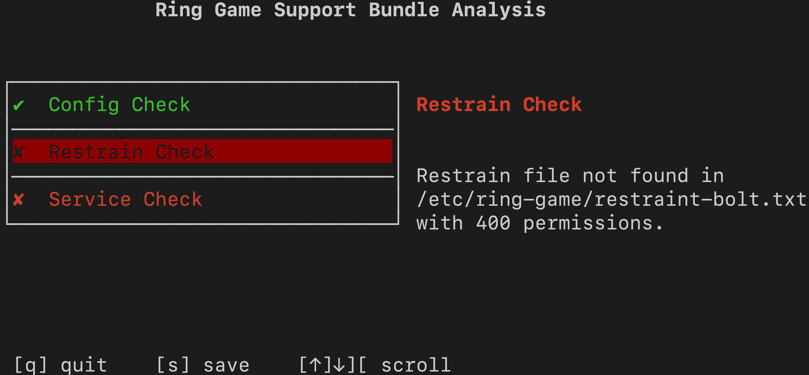
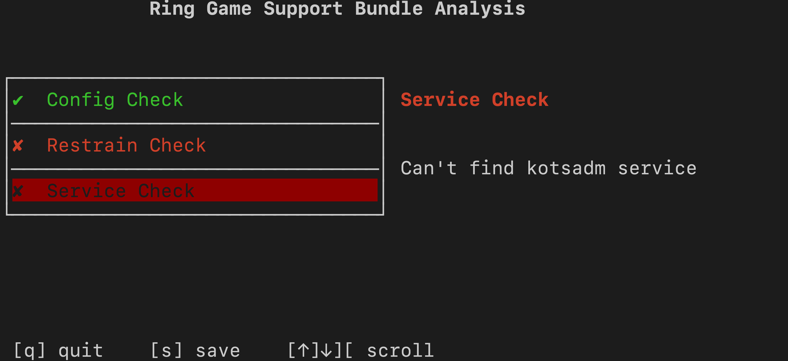

# Solution for Replicated Quest for the Ring

If you have landed here, you probably have run into this issue:

<p align="center"></img></p>

This error is caused when the app does not find a specific file with the proper permissions on startup. The application is looking for a file called `config.txt` located in `/etc/ring-game/` which is a [hostPath](https://kubernetes.io/docs/concepts/storage/volumes/#hostpath) Volume attached to the Pod. The file must have `400` permissions.

## Creating a config file

1. Create the file and assign `400` permissions.

<details>
  <summary>Open for a hint on how to create the file and assign permissions</summary>

To create the file with the proper permissions run the following command on the terminal:

```shell
$ sudo touch /etc/ring-game/config.txt
$ sudo chmod 400 /etc/ring-game/config.txt
```

</details>

1. Restart the pod, if needed. get the list of pods and delete the offending pod. Its `Deployment` should schedule a new one right away.

<details>
  <summary>Open for a hint on how to find the offending pod and delete it</summary>

To get the list of pods, run the following command:

```shell
$ kubectl get pods
```

You should see an output similar to this:

```shell

NAME                                  READY   STATUS                  RESTARTS   AGE
file-check-pod-76c6bc76d-7xk2d        1/1     Running                 0          9m57s
kotsadm-7d68c66d9-wbx5t               1/1     Running                 0          87m
kotsadm-postgres-0                    1/1     Running                 0          87m
kubecon-game-77b49b445-mwfvn          0/1     Init:CrashLoopBackOff   6          9m57s
kurl-proxy-kotsadm-75cf6dcf54-m74vm   1/1     Running                 0          87m


```

The offending pod is the one in the `Init:CrashLoopBackOff` STATUS. To delete the pod, run the following command:

```shell

$ kubectl delete pod kubecon-game-77b49b445-mwfvn

```
</details>

1. Return to the Admin Console in your browser

1. Select the `Application` tab to view the Application's Status. Check that the app is now up and running. Refresh the browser if needed.

## Another Issue

If refreshing the page yields a `404` or similar error (page not found), this could mean more issues. How can we generate a support bundle if we can't access the UI?

Thankfully, [Troubleshoot](https://troubleshoot.sh) provides both a `pre-flight` and `support-bundle` plugins for `kubectl`. To collect a Support Bundle from the command line, we will use the `support-bundle` plugin, which is already installed on this Cluster (Clusters installed by kURL by default have these plugins installed).

All we need to do is provide it a `Support Bundle` spec to tell it which `collectors` and `analyzers` to run.

1. Create a `support-bundle.yaml` file with the following contents:

<details>
  <summary>Expand for Manifest Content</summary>

```yaml

apiVersion: troubleshoot.sh/v1beta2
kind: SupportBundle
metadata:
  name: ring-game
spec:
  collectors:
    - clusterInfo: {}
    - clusterResources: {}
    - logs:
        selector:
          - app=kubecon-game
        namespace: default
        limits:
          maxAge: 30d
          maxLines: 10000
    - exec:
        name: check-config
        collectorName: check-config
        selector:
          - app=file-check-pod
        namespace: default
        args:
        - stat
        - -c
        - "%a"
        - /etc/ring-game/config.txt
    - exec:
        name: check-restrain
        collectorName: check-restrain
        selector:
          - app=file-check-pod
        namespace: default
        args:
        - stat
        - -c
        - "%a"
        - /etc/ring-game/restraining-bolt.txt

  analyzers:
    - textAnalyze:
        checkName: Config Check
        fileName: check-config/default/*/check-config-*.txt
        regex: '400'
        outcomes:
          - pass:
              message: Found Config File!!!
          - fail:
              message: Config file not found. Please check this [article](https://github.com/replicatedhq/kotsapps/blob/kc2021-ring-game/kubecon-2021-ring-game/content/solutions/easysolve.md)
    - textAnalyze:
        checkName: Restrain Check
        fileName: check-restrain/default/*/check-restrain-*.txt
        regex: '400'
        outcomes:
          - pass:
              message: Found Restraint File!!!
          - fail:
              message: Restrain file not found in /etc/ring-game/restraining-bolt.txt with 400 permissions.
    - textAnalyze:
        checkName: Service Check
        fileName: cluster-resources/services/default.json
        regex: '"name": "kotsadm"'
        outcomes:
          - pass:
              message: "kotsadm service found!"
          - fail:
              message: "Can't find kotsadm service"

```

</details>

In the spec above, we have five `collectors` defined. Two capture cluster information, one collects logs from any pod that has the label `app=kubecon-game` and two that `exec` into the first pod it finds with the label `app=file-check-pod` to check for files with specific permissions. We also have three `analyzers` and the results of these will be displayed to the end user. All of the `analyzers` in this spec are using `RegEx` on the output of the `collectors` to determine a pass/fail scenario.

1. Run the following command from the same terminal once the file is created:

    ```shell
    $ kubectl support-bundle support-bundle.yaml

    ```

    Once you run the support bundle command, you should see this:

    <p align="center"></img></p>

    As you can see you can scroll down to see the other two results:

    <p align="center"></img></p>
    <p align="center"></img></p>

## Solution

There are two issues that we need to address:

* The file `restraining-bolt.txt` is missing from `/etc/ring-game` directory
* The `kotsadm` service is missing

To solve the issue, we repeat the same steps as before. Don't forget to ensure the file also has permissions set to `400`.

<details>
  <summary>Open for a hint on how to create the file and assign permissions</summary>

To create the file with the proper permissions run the following command on the terminal:

```shell
$ sudo touch /etc/ring-game/restraining-bolt.txt
$ sudo chmod 400 /etc/ring-game/restraining-bolt.txt
```

</details>


To solve the second issue, we need to create the service. The service must meet the following criteria:

* **name:** kotsadm
* **type:** ClusterIP
* **selector:** app: kotsadm
* **port:** 3000
* **targetPort:** http


<details>
  <summary>Hint: Open to see the Service Definition Manifest</summary>

1. Create and edit a file called `kotsadm.yaml` in your local directory.

    Once in the file, paste the following content

    ```yaml

    apiVersion: v1
    kind: Service
    metadata:
      labels:
        kots.io/backup: velero
        kots.io/kotsadm: "true"
      name: kotsadm
      namespace: default
    spec:
      ports:
      - name: http
        port: 3000
        targetPort: http
      selector:
        app: kotsadm
      type: ClusterIP
    status:
      loadBalancer: {}

    ```

1. Create the service:

    ```shell
    $ kubectl apply -f kotsadm.yaml
    ```

</details>

Once you have created the service, refresh the browser a few more times and the Admin Console should come back up.

Lastly, the app itself may take a while to try again so you should probably delete the `kubecon-game-*` pod so a new one is scheduled.

<details>
  <summary>Open for a hint on how to schedule a new Pod</summary>

To get the list of pods, run the following command:

```shell
$ kubectl get pods
```

You should see an output similar to this:

```shell

NAME                                  READY   STATUS                  RESTARTS   AGE
file-check-pod-76c6bc76d-7xk2d        1/1     Running                 0          9m57s
kotsadm-7d68c66d9-wbx5t               1/1     Running                 0          87m
kotsadm-postgres-0                    1/1     Running                 0          87m
kubecon-game-77b49b445-mwfvn          0/1     Init:CrashLoopBackOff   6          9m57s
kurl-proxy-kotsadm-75cf6dcf54-m74vm   1/1     Running                 0          87m


```

The offending pod is the one in the `Init:CrashLoopBackOff` STATUS. To delete the pod, run the following command:

```shell

$ kubectl delete pod kubecon-game-77b49b445-mwfvn

```
</details>

At this point the App Status should show `Ready`. Click on the `Complete the Quest` button to complete the quest!
