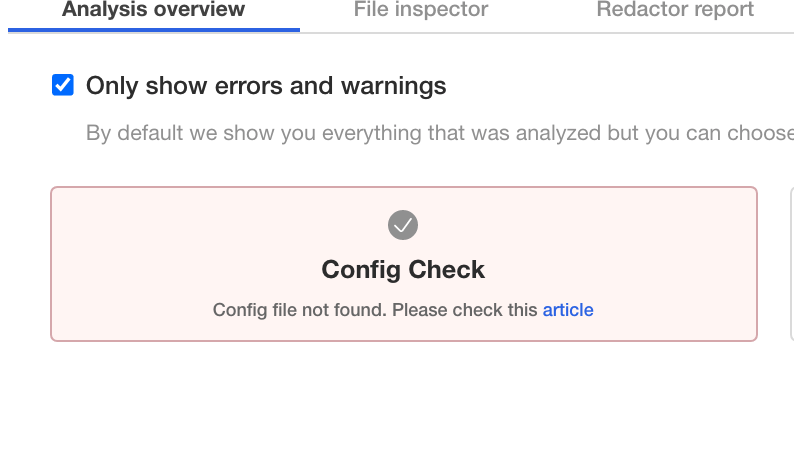

<h1> Solution for Replicated Quest for the Ring </h1>

If you have landed here, you probably have run into this issue:

<p align="center"></img></p>

This error is caused when the app does not find a specific file with the proper permissions on startup. The application is looking for a file called `config.txt` located in `/etc/ring-game/` which is a [hostPath](https://kubernetes.io/docs/concepts/storage/volumes/#hostpath) Volume attached to the Pod. The file must have `400` permissions.

To solve the issue, create the file and assign `400` permissions.

<details>
  <summary>Open for a hint on how to create the file and assign permissions</summary>

To create the file with the proper permissions run the following command on the terminal:

```shell
$ sudo touch /etc/ring-game/config.txt
$ sudo chmod 400 /etc/ring-game/config.txt
```

</details>

The Pod may need to be restarted, in that case, get the list of pods and delete the offending pod. Its ```Deployment``` should schedule a new one right away.

<details>
  <summary>Open for a hint on how to find the offending pod and delete it</summary>

To get the list of pods, run the following command:

```shell
$ kubectl get pods
```

You should see an output similar to this:

```shell

NAME                                  READY   STATUS                  RESTARTS   AGE
file-check-pod-76c6bc76d-7xk2d        1/1     Running                 0          9m57s
kotsadm-7d68c66d9-wbx5t               1/1     Running                 0          87m
kotsadm-postgres-0                    1/1     Running                 0          87m
kubecon-game-77b49b445-mwfvn          0/1     Init:CrashLoopBackOff   6          9m57s
kurl-proxy-kotsadm-75cf6dcf54-m74vm   1/1     Running                 0          87m


```

The offending pod is the one in the `Init:CrashLoopBackOff` STATUS. To delete the pod, run the following command:

```shell

$ kubectl delete pod kubecon-game-77b49b445-mwfvn

```
</details>

Once the new pod is up and running, go back to the Admin Console to check that the app is now up and running.

Select the `Application` tab to view the Application's Status. Refresh the browser if needed.

If refreshing the page yields a `404` or similar error (page not found), this could mean more issues. But since we can't access the UI, how can we generate a support bundle?

Thankfully, [Troubleshoot](https://troubleshoot.sh) provides both a `pre-flight` and `support-bundle` plugins for `kubectl`. To collect a Support Bundle from the command line, we will use the `support-bundle` plugin, which is already installed on this Cluster (Clusters installed by kURL by default have these plugins installed).

All we need to do is provide it a `Support Bundle` spec to tell it which `collectors` and `analyzers` to run.

Open you favorite Linux editor and create a `support-bundle.yaml` file with the following contents:

<details> 
  <summary>Expand for Manifest Content</summary>
  
```yaml

apiVersion: troubleshoot.sh/v1beta2
kind: SupportBundle
metadata:
  name: ring-game
spec:
  collectors:
    - clusterInfo: {}
    - clusterResources: {}
    - logs:
        selector:
          - app=kubecon-game
        namespace: default
        limits:
          maxAge: 30d
          maxLines: 10000
    - exec:
        name: check-config
        collectorName: check-config
        selector:
          - app=file-check-pod
        namespace: default
        args:
        - stat
        - -c
        - "%a"
        - /etc/ring-game/config.txt
    - exec:
        name: check-restrain
        collectorName: check-restrain
        selector:
          - app=file-check-pod
        namespace: default
        args:
        - stat
        - -c
        - "%a"
        - /etc/ring-game/restraining-bolt.txt 
     
  analyzers:
    - textAnalyze:
        checkName: Config Check
        fileName: check-config/default/*/check-config-*.txt
        regex: '400'
        outcomes:
          - pass:
              message: Found Config File!!!
          - fail:
              message: Config file not found. Please check this [article](https://github.com/replicatedhq/kotsapps/blob/kc2021-ring-game/kubecon-2021-ring-game/content/solutions/easysolve.md)
    - textAnalyze:
        checkName: Restrain Check
        fileName: check-restrain/default/*/check-restrain-*.txt
        regex: '400'
        outcomes:
          - pass:
              message: Found Restraint File!!!
          - fail:
              message: Restrain file not found in /etc/ring-game/restraint-bolt.txt with 400 permissions.
    - textAnalyze:
        checkName: Service Check
        fileName: cluster-resources/services/default.json
        regex: '"name": "kotsadm"'
        outcomes:
          - pass:
              message: "kotsadm service found!"
          - fail:
              message: "Can't find kotsadm service"

```

</details>

Once the file is created, run the following command from the same terminal:

```shell

$ kubectl support-bundle support-bundle.yaml

```


<details>
  <summary>Open to see the Service Definition Manifest</summary>

```yaml

apiVersion: v1
kind: Service
metadata:
  creationTimestamp: null
  labels:
    kots.io/backup: velero
    kots.io/kotsadm: "true"
  name: kotsadm
  namespace: default
spec:
  ports:
  - name: http
    port: 3000
    targetPort: http
  selector:
    app: kotsadm
  type: ClusterIP
status:
  loadBalancer: {}

```
</details>

